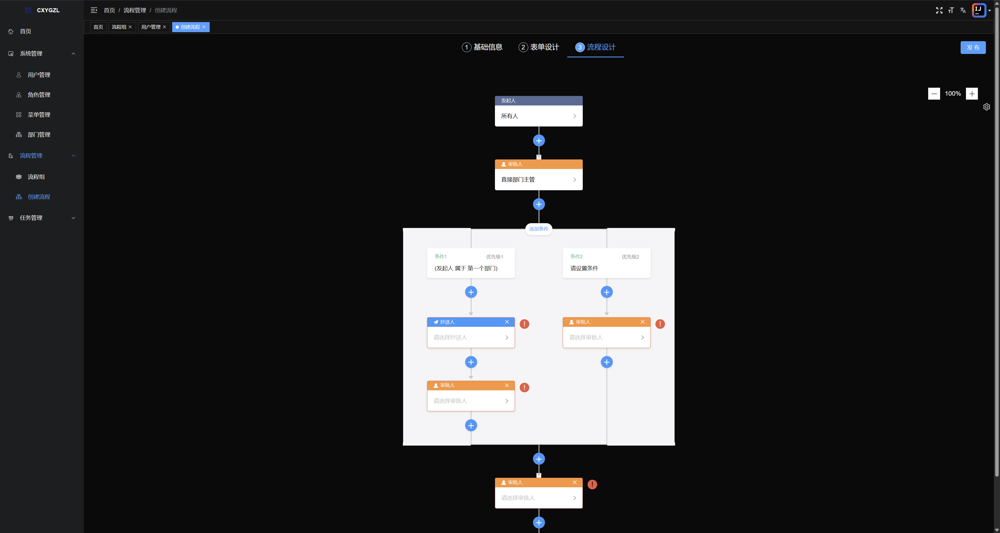

# 
<strong> CXYGZL-不只审批 </strong>

    
    
    
    
    
    
    

### 概述
现在开源的工作流引擎，基本都是以BPMN.js为基础的，导致使用门槛过高，非专业人员无法驾驭。本工作流借鉴钉钉/飞书的方式，以低代码方式降低用户使用门槛，即使是普通企业用户也可以几分钟内就能搭建自己的工作流引擎。

前端管理后台框架使用的是 [vue3-element-admin](https://gitee.com/youlaiorg/vue3-element-admin "vue3-element-admin")，流程图使用的是[Workflow-Vue3](https://github.com/StavinLi/Workflow-Vue3 "Workflow-Vue3")。在此特别感谢两个产品的作者无私奉献，让我抄了个近道，特别感谢。

> 前端代码开源地址：[https://gitee.com/junyue/cxygzl-web-vue3](https://gitee.com/junyue/cxygzl-web-vue3 "https://gitee.com/junyue/cxygzl-web-vue3")

### 官网-文档

[https://www.cxygzl.com](https://www.cxygzl.com "https://www.cxygzl.com")

### 技术架构
前端：Vue3+ElementPlus

后端：SpringBoot2.7.6（jdk8）+Mysql8+MybatisPlus+Flowable6.8.0+Hutool+SaToken

### 技术交流群
 
添加作者个人微信进群`cxygzl666`备注：`cxygzl`

### 关于开源协议以及补充协议

#### 1、本项目如果个人使用完全免费，不受任何影响
#### 2、禁止以商业化方式再次出售分享本项目相关源代码
#### 3、允许商业化出售编译后的前端和后端代码
#### 4、本项目已申请软件著作权，尊重开源产品，尊重作者付出的劳动成果
#### 5. 不得将本软件应用于危害国家安全、荣誉和利益的行为，不能以任何形式用于非法为目的的行为
#### 6. 任何基于本软件而产生的一切法律纠纷和责任，均与作者无关

### 功能列表
详细功能可到官网查看

